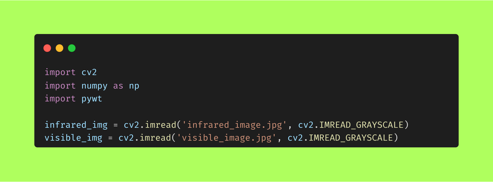

# Multi-scale-image-fusion

  

>这是一个有趣的项目

>使用Opencv以及PyWavelet库，使用小波变换和拉普拉斯金字塔进行多尺度图像融合

>之后考虑使用python来完成一个项目的所有流程，包括写ppt

## 更新
- 🛠️ 2023/06/23
  
- wpsAI可以直接制作ppt了，所以ppt项目分支取消
  
- 🛠️ 2023/05/29 

-完成了小波变换多尺度分解

-增加了分解的每一层还原为一张图像的程序

-融合策略修改为自定义权重进行融合，方便自行选择不同合适的策略

- 🛠️ 2023/05/23：支持了RGB多通道图像融合，用以恢复彩色图像。

- 🌟 2023/05/20：完成程序调试，基本实现功能。

## 流程说明

使用python编程，利用小波变换和拉普拉斯金字塔来完成图像处理，这里面设计到计算机视觉以及信号处理（硬核？！）

使用python来制作ppt（其实也考虑了Markdown+Vscode+Remark.js），方便我（们）进行答辩

## 关于方案

1.**浏览github**
  - 学习理论小波变换和金字塔分解。
  - 寻找使用python—opencv进行图像处理的项目，对代码进行复现和学习。（痛苦）
 
2.**查看官方说明文档**
  - 幸运PyWavelet官方有很多例子和教程说明。
  - opencv生涩难懂。

3.**打开pycharm**
  - 调试代码
  - 分析结果的指标

## 项目文件说明
  - Evaluate the effect里面是评价代码，计算互相关系数是单独的
  - Layer images 里面是分层结果，里面有两种方法的每一层图像
  - python_ppt 里面是制作ppt的一个简易程序，完整版还未完成
